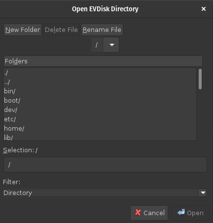

# EVDisk

EVDisk creates and manages an encrypted file system provided by
a directory containing three entries:

  - a file named **encrypted**
  - a file name **key.gpg**
  - an empty directory named **root**

The file **encrypted** is typically a very large file representing
an LUKS encrypted file system.  The file **key.gpg** contains the
LUKS password, but encrypted by GPG. When run, **evdisk** will
use GPG to decrypt the key, and will then mount the encrypted
file system on the mount point **root**.  A window will then
appear with a Close button for unmounting the file system.  It is
also possible to run **evdisk** totally from the command line
(useful when using **evdisk** with a remote system). The options
are described in the man page.

To install **evdisk**, first add a Debian repository (if not yet
available) as described by <https://billzaumen.github.io/bzdev/>.
Then run the command

```
sudo apt-get install evdisk
```

The installation will include a desktop file.

## Screenshots

When the command

```
evdisk
```

is run, or when EVDisk is started by clicking on an icon, etc.,
the following window will appear:



After navigating to a directory containing a set of evdisk files,
the 'Open' button will be active. Clicking it will bring up the
following dialog box:


Closing this dialog box (e.g., by pushing the Close button) will shut
down the encrypted file system that EVDisk provides and the dialog
box will disappear.
